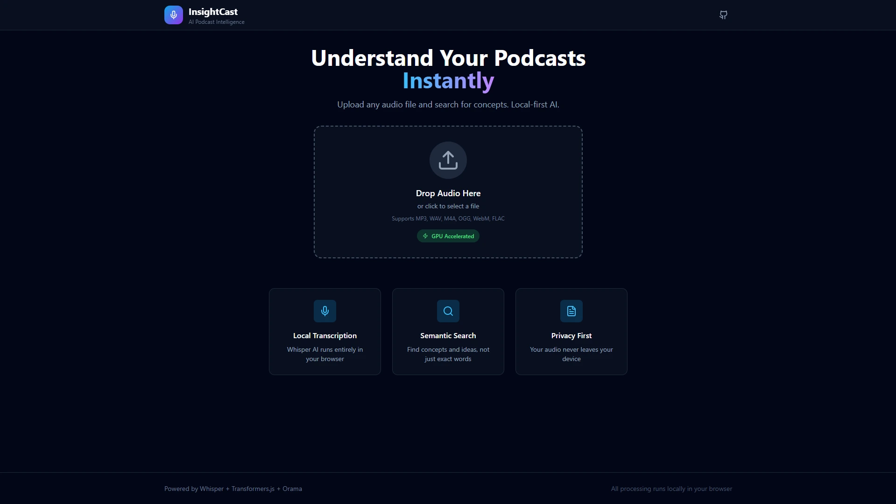

# InsightCast

A browser-based podcast analysis tool powered by local AI. Transcribe audio files, index them semantically, and search for concepts, not just keywords to jump to specific timestamps.



## Features

- 🎙️ **Local Transcription** - Whisper AI runs entirely in your browser
- 🔍 **Semantic Search** - Find concepts and ideas, not just exact words
- 🔒 **Privacy First** - Your audio never leaves your device
- ⚡ **WebGPU Accelerated** - GPU-powered inference when available
- 📱 **Responsive UI** - Works on desktop and tablet devices

## Tech Stack

- **Framework**: React 18 + Vite 5.x
- **Language**: TypeScript 5.x (Strict Mode)
- **Styling**: Tailwind CSS
- **AI Runtime**: @huggingface/transformers v3 (WebGPU support)
- **Vector Database**: @orama/orama (In-memory vector store)
- **State Management**: React Context + Custom Hooks

## Getting Started

### Prerequisites

- Node.js 18+ 
- A modern browser with WebGPU support (Chrome 13+, Edge 13+) for GPU acceleration
- Browsers without WebGPU will fall back to WASM (slower but works everywhere)

### Installation

##### Clone the repository
```bash
git clone https://github.com/Codemos-official/hackathon_2025_arpanpatra.git
cd insightcast
```

##### Install dependencies
```bash
npm install
```

##### Start development server
```bash
npm run dev
```

The app will be available at `http://localhost:5173`

## Architecture

### Main Thread Zero-Block Policy

All heavy compute tasks run inside a dedicated Web Worker:
- Model Loading (Whisper ASR + Embedding Model)
- Audio Transcription
- Embedding Generation
- Vector Search

The main thread handles only UI rendering and audio playback.

### AI Models

- **ASR**: `onnx-community/whisper-base` - Speech recognition
- **Embeddings**: `mixedbread-ai/mxbai-embed-xsmall-v1` - Semantic embeddings (384 dims)

### WebGPU Fallback

The app automatically detects WebGPU availability:
1. Attempts WebGPU initialization first (faster)
2. Falls back to WASM if WebGPU unavailable
3. Notifies user of current mode via status indicator

## Usage

1. **Wait for Model Loading** - First load downloads ~150MB of AI models
2. **Upload Audio** - Drag and drop or click to select (MP3, WAV, M4A, OGG, WebM, FLAC)
3. **Wait for Transcription** - Processing time depends on audio length and device
4. **Search** - Enter concepts, topics, or questions in the search bar
5. **Navigate** - Click segments or waveform regions to jump to timestamps

## Supported Audio Formats

- MP3
- WAV
- M4A
- OGG
- WebM
- FLAC

## Browser Compatibility

| Browser | WebGPU | WASM Fallback |
|---------|--------|---------------|
| Chrome 113+ | ✅ | ✅ |
| Edge 113+ | ✅ | ✅ |
| Firefox | ❌ | ✅ |
| Safari 18+ | ✅ | ✅ |

## Development

### Project Structure

```
src/
├── components/          # React components
│   ├── AudioVisualizer.tsx
│   ├── AudioPlayer.tsx
│   ├── DropZone.tsx
│   ├── SearchBar.tsx
│   └── TranscriptView.tsx
├── hooks/               # Custom React hooks
│   ├── useInsight.ts
│   ├── useAudioPlayer.ts
│   └── InsightContext.tsx
├── types.ts             # TypeScript definitions
├── worker.ts            # AI Web Worker
├── App.tsx              # Main application
└── main.tsx             # Entry point
```

### Key Configuration

- `vite.config.ts` - WASM asset copying and worker configuration
- `tsconfig.json` - TypeScript strict mode with WebWorker lib
- `tailwind.config.js` - Custom color palette and animations

## Performance Tips

- First load is slower due to model download (~150MB)
- Models are cached in browser storage after first download
- WebGPU provides 2-5x faster inference than WASM
- Shorter audio files transcribe faster
- Close other GPU-intensive applications for best performance

## License

MIT

## Acknowledgments

- [Hugging Face Transformers.js](https://github.com/xenova/transformers.js)
- [Orama Search](https://github.com/oramasearch/orama)
- [OpenAI Whisper](https://github.com/openai/whisper)
